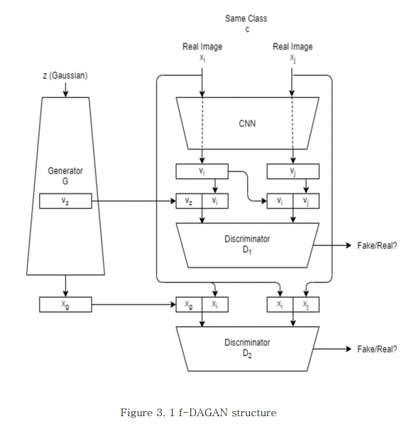

# f_DAGAN (Thesis)
Data Augmentation based on data and feature spaces 
# Training
  1. Change the path of dataloader dataset.py
  2. Only one class data train at a time 
  3. Now network only train with MNIST 

